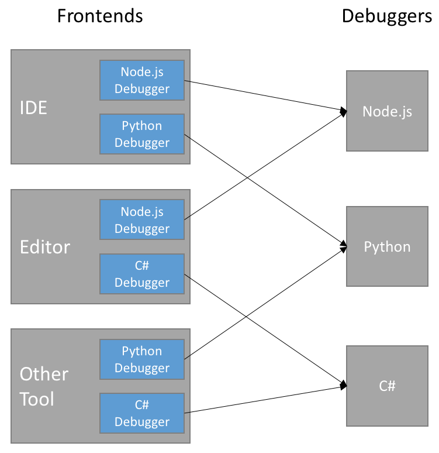
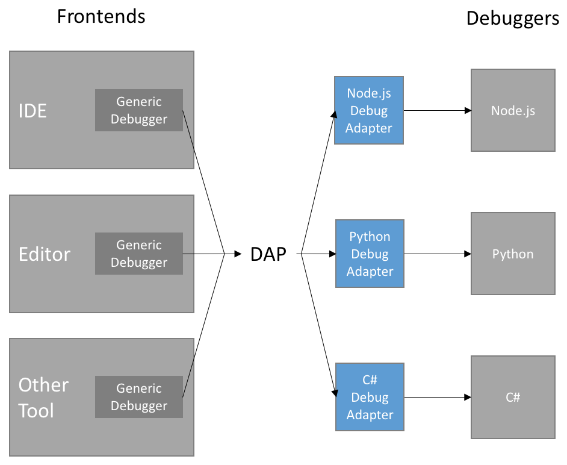
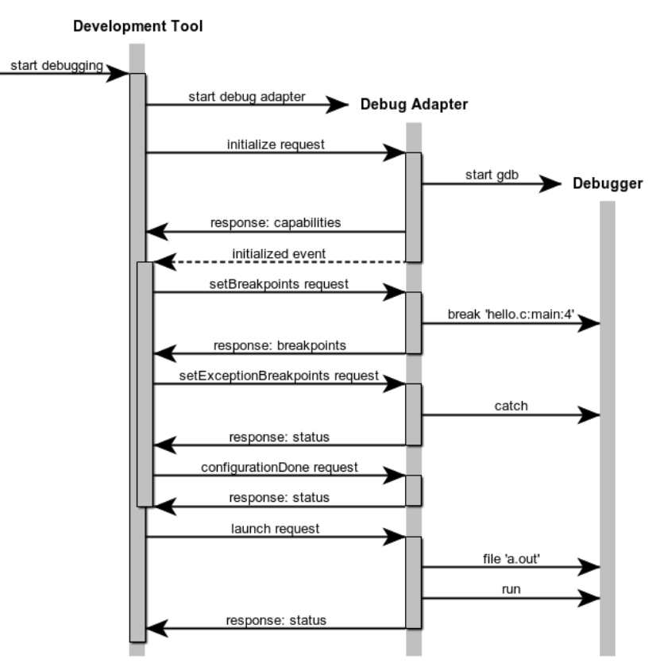
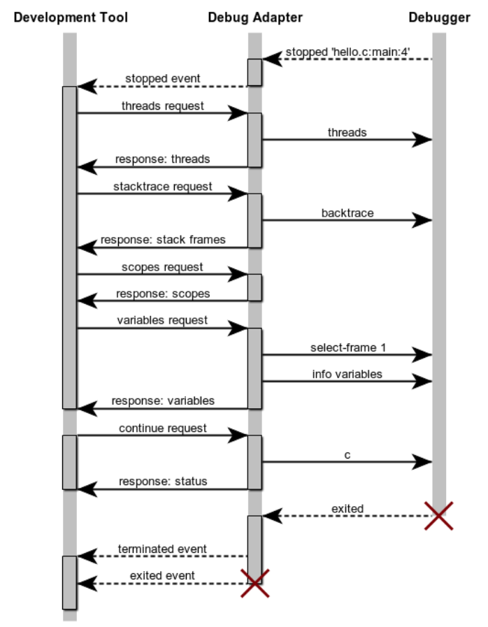

## What is the Debug Adapter Protocol?

It takes a significant effort to implement the UI for a new debugger for features like:
- source-, function-, conditional-, and inline breakpoints,
- variable values shown in hovers or inlined in the source,
- multi-process and  multi-thread support,
- navigating through complex data structures,
- watch expressions,
- debug console for interactive evaluation with autocomplete (aka REPL),
- log points.

Typically this work must be repeated for each development tool, as each tool uses different APIs for implementing its user interface.
This results in lots of duplicated functionality (and implementation) as visualized by the blue boxes in the following picture:



The idea behind the _Debug Adapter Protocol_ is to standardize an abstract protocol for how a development tool communicates with concrete debuggers.

Since it is unrealistic to assume that existing debuggers or runtimes adopt this protocol any time soon,
we rather assume that an _intermediary_ component takes over the role of adapting an existing debugger or runtime API to the Debug Adapter Protocol.
This intermediary becomes the _Debug Adapter_ which explains the name of the protocol: _Debug Adapter Protocol_.
The following picture shows the resulting architecture:



The diagram shows that the Debug Adapter Protocol makes it possible to implement a single generic debugger UI per development tool
and that Debug Adapters can be re-used across these tools. This reduces the effort to support a new debugger considerably.

Standardizing on a wire-protocol instead of an API and a client library has the advantage that a debug adapter can be implemented in the language most suitable for the given debugger or runtime.

Since the _Debug Adapter Protocol_ was designed for supporting the debugging UI in a language agnostic way,
it is fairly high-level and does not have to surface all the fine details of the underlying language and low-level debugger API.
The most important data type used in the protocol are strings, because that's what the end user will see in the UI.
So Debug Adapters typically aggregate information received via debugger APIs into high-level, string-based data-structures that are directly consumed in the UI of the development tool.
Since this mapping is mostly straightforward and has little complexity, Debug adapters can be developed with minimal effort.

The _Debug Adapter Protocol_ is a win for both debugger/runtime providers and tooling vendors!

## How it works

The following sections explains the interaction between a development tool (e.g. IDE or editor) and a debug adapter.
This should not only help when implementing the Debug Adapter Protocol in a debug adapter, but also when _hosting_ the protocol in a development tool (sometimes also called "host" or "client").

### Debug Session Start

When a debug session starts, the development tool needs a way to communicate with the debug adapter that implements the Debug Adapter Protocol.
How the debug adapter comes to life is not part of the protocol specification, but it is still an important detail if debug adapters should work across different development tools.

A development tool has basically two ways of interacting with a debug adapter:
- **single session mode**: in this mode the development tool starts a debug adapter as a standalone process and communicates with it through *stdin* and *stdout*. At the end of the debug session the debug adapter is terminated. For concurrrent debug sessions the development tool starts multiple debug adapters.
- **multi session mode**: in this mode the development tool does not start the debug adapter but assumes that it is already running and that it listens on a specific port for connections attempts. For every debug session the development tool initiates a new communication session on the specific port and disconnects at the end of the session.

After establishing a connection to the debug adapter, the development tool starts communicating with the adapter via the _base protocol_.

### Base protocol

The base protocol exchanges messages that consist of a header and a content part (comparable to HTTP).
The header and content part are separated by a `\r\n` (carriage return, line feed).

#### Header Part

The header part consists of header fields. Each header field is comprised of a key and a value, separated by ': ' (a colon and a space).
Each header field is terminated by `\r\n`.

Since both the last header field and the overall header itself are each terminated with `\r\n`,
and since the header is mandatory, the content part of a message is always preceded (and uniquely identified) by two `\r\n` sequences.

Currently only a single header field is supported and required:

| Header Field Name | Value Type  | Description |
|:------------------|:------------|:------------|
| Content-Length    | number      | The length of the content part in bytes. This header is required. |
{: .table .table-bordered .table-responsive}

The header part is encoded using the 'ASCII' encoding. This includes the `\r\n` separating the header and content part.

#### Content Part

The content part contains the actual content of the message. The content part of a message uses JSON to describe [requests](./specification#Base_Protocol_Request), [responses](./specification#Base_Protocol_Response), and [events](./specification#Base_Protocol_Event).

The content part is encoded using `utf-8`.

#### Example:

This example shows the JSON for the DAP [next](./specification#Requests_Next) request:

```
Content-Length: 119\r\n
\r\n
{
    "seq": 153,
    "type": "request",
    "command": "next",
    "arguments": {
        "threadId": 3
    }
}
```

### Initialization

The Debug Adapter Protocol defines many features and this number is still growing, albeit slowly.
However, the protocol is still at its first version because it was an explicit design goal to support new feature in a completely backward compatible way.
Making this possible without version numbers requires that every new feature gets a corresponding flag that lets a development tool know whether a debug adapter supports the feature or not. And the absense of the flag always means that the feature is not supported.

A single feature and its corresponding flag is called "capability" in the Debug Adapter Protocol. The open-ended set of all features flags is called "capabilities."

When starting a debug session the development tool sends an [**initialize**](./specification#Requests_Initialize) request to the adapter in order to exchange capabilities between the development tool and the debug adapter.

The development tool capabilities are provided in the [**InitializeRequestArguments**](./specification#Types_InitializeRequestArguments) structure of the [**initialize**](./specification#Requests_Initialize) request and typically start with the prefix "supports."
Other information passed from the tool to the debug adapter is:
- the name of the development tool,
- the format of file paths, `native` or `uri`,
- whether line and column values are 0 or 1 based,
- the locale used by the development tool. A debug adapter is expected to return error messages that honor this locale.

The debug adapter returns the supported capabilities in the [**InitializeResponse**](./specification#Types_InitializeResponse) via the [**Capabilities**](./specification#Types_Capabilities) type.
It is not necessary to return an explicit `false` for unsupported capabilities.

### Launching and attaching to debuggees

After the debug adapter has been initialized it is ready to accept requests for starting debugging.
Two requests exist for this:
- [**launch**](./specification#Requests_Launch): the debug adapter launches the program in debug mode and then starts to communicate with it.
Since the debug adapter is responsible for the debuggee, it must ensure that the program is launched from an interactive terminal so that the user
can interact with it via stdin/stdout and that the program is terminated properly at the end of the debug session.

- [**attach**](./specification#Requests_Attach): the debug adapter connects to an already running program. Here the end user is responsible for launching and terminating the program.

Since arguments for both requests are highly dependent on a specific debugger and debug adapter implementation, the Debug Adapter Protocol does not specify any arguments for these requests.
Instead the development tool is expected to get information about debugger specific arguments from elsewhere (e.g. contributed by some plugin or extension mechanism)
and to build a UI and validation mechanism on top of that.

### Configuring breakpoint and exception behavior

Since the development tool implements a generic debugger UI, it is responsible for managing breakpoints and other configurable options like exceptions.
This configuration information must be passed to the debug adapter before program execution starts.
Some debuggers are able to deal with this information very early, even before the debuggee is known; other debuggers accept this information only when the debuggee is about to start running.

Since the development tool does not know when is the correct moment for passing the configuration information to the adapter,
the debug adapter is expected to send an [**initialized**](./specification#Events_Initialized) event to the development tool
to announce that it is ready to accept configuration requests.
With this approach a debug adapter does not have to implement a buffering strategy for configuration information.

In response to the *initialized* event the development tool sends the configuration information by calling these requests:
* [**setBreakpoints**](./specification#Requests_SetBreakpoints) one request for all breakpoints in a single source,
* [**setFunctionBreakpoints**](./specification#Requests_SetFunctionBreakpoints) if the debug adapter supports function breakpoints,
* [**setExceptionBreakpoints**](./specification#Requests_SetExceptionBreakpoints) if the debug adapter supports any exception options,
* [**configurationDoneRequest**](./specification#Requests_ConfigurationDone) to indicate the end of the configuration sequence.

The *setBreakpoints* request registers all breakpoints that exist for a single source (so it is not incremental).
A simple implementation of this semantics in the debug adapter is to clear all previous breakpoints for the source and then set the breakpoints specified in the request.
*setBreakpoints* and *setFunctionBreakpoints* are expected to return the 'actual' breakpoints and the frontend updates the UI dynamically if a breakpoint could not be set at the requested position and was moved by the debugger.

The following sequence diagram summarizes the sequence of requests and events for a hypothetical _gdb_ debug adapter:



### Stopping and resuming

Whenever the program stops (on program entry, because a breakpoint was hit, an exception occurred, or the user requested execution to be paused),
the debug adapter sends a [**stopped**](./specification#Events_Stopped) event with the appropriate reason and thread id.

Upon receipt the development tool first requests the [`threads`](./specification#Types_Thread) (see below), and then the *stacktrace* (a list of [`stack frames`](./specification#Types_StackFrame)) for the thread mentioned in the stopped event.
If the user then drills into the stack frame, frontend first requests the [`scopes`](./specification#Types_Scope) for a stack frame, and then the [`variables`](./specification#Types_Variable) for a scope.
If a variable is itself structured, frontend requests its properties through additional *variables* requests.
This leads to the following hierarchy:

```
Threads
   Stackframes
      Scopes
         Variables
            ...
               Variables
```

Whenever the frontend receives a [**stopped**](./specification#Events_Stopped) or a [**thread**](./specification#Events_Thread) event, frontend requests all [`threads`](./specification#Types_Thread) that exist at that point in time. [**Thread**](./specification#Events_Thread) events are optional but a debug adapter can send them to force the frontend to update the threads UI dynamically even when not in a stopped state.

After a successful *launch* or *attach* the frontend requests the baseline of currently existing threads with the [**threads**](./specification#Requests_Threads) request and then starts to listen for [**thread**](./specification#Events_Thread) events to detect new or terminated threads. Even if your debug adapter does not support multiple threads, it must implement the [**threads**](./specification#Requests_Threads) request and return a single (dummy) thread. The id of this thread must be used in all requests where a thread id is required, e.g. [**stacktrace**](./specification#Requests_Stacktrace), [**pause**](./specification#Requests_Pause), [**continue**](./specification#Requests_Continue), [**next**](./specification#Requests_Next), [**stepIn**](./specification#Requests_StepIn), and [**stepOut**](./specification#Requests_StepOut).

This diagram summarizes the sequence of request and events for a hypothetical debug adapter for _gdb_:


### Debug session end

The development tool terminates a debug session with the [**disconnect**](./specification#Requests_Disconnect) request.
If the debug target was 'launched' *disconnect* is expected to terminate the target program (forcefully if necessary).
If the debug target has been 'attached' initially, *disconnect* should detach it from the target (so that it will continue to run).
In both cases and in the case that the target terminated normally or crashed the debug adapter must fire a [**terminated**](./specification#Events_Terminated) event.
After receiving a response from the *disconnect* request, the frontend terminates the debug adapter.

## Libraries (SDKs) for DAP providers and consumers

To simplify the implementation of debug adapters there are libraries or SDKs:

- *Debug Adapter SDKs* for the different implementation languages there is an SDK to implement a debug adapter in a particular language. For example, to implement a debug adapter using Node.js there is the [debug adapter npm module](https://www.npmjs.com/package/vscode-debugadapter).
